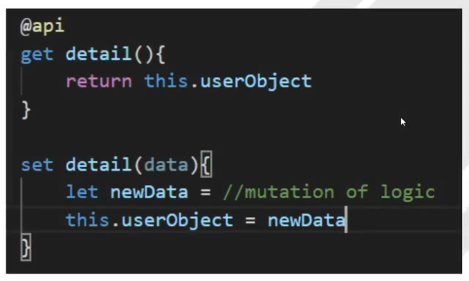
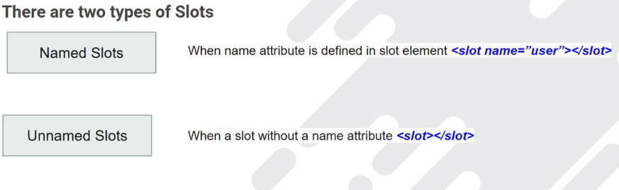

Setter Method
    This method is use to modified the data coming from parent component.
    if Object is passed as data to setter, to mutate the object we have to create a shallow copy.
    

Passing Markup into Slots
    1. Slot is useful to pass HTML markup into the another component.
    2. `<slot></slot>` markup is used to catch the HTML passed by parent component.
    3. You can't pass an Aura component into a slot.
    

CSS behaviour in Parent Child Component
    1. Parent CSS can't reach into a child component.
    2. A parent component CSS can style a host element (`<c-css-child>`).
    3. A Child Component CSS can reach up and style its own host element.
    4. You can Style to a element pass into the slot from the parent component only.
    