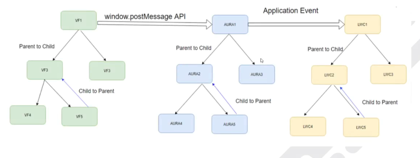
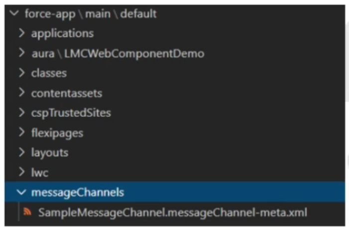
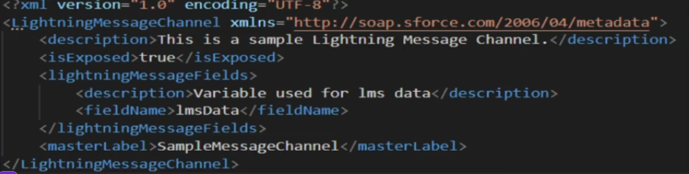
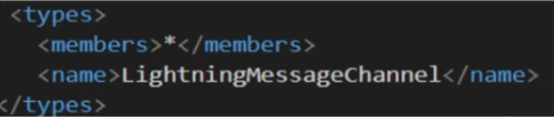
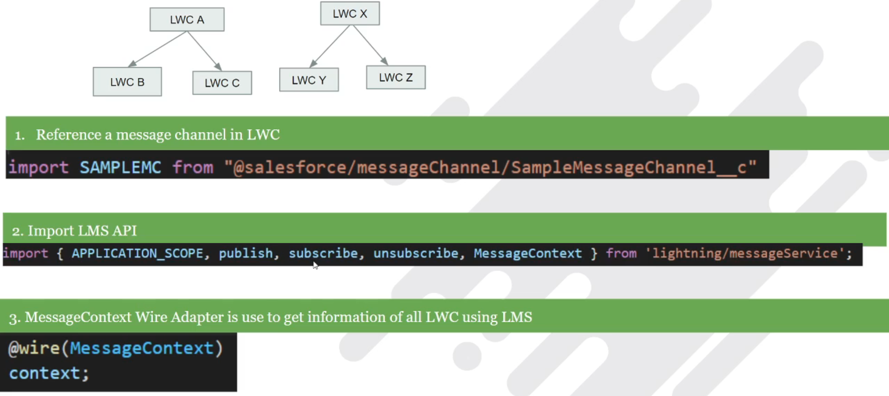
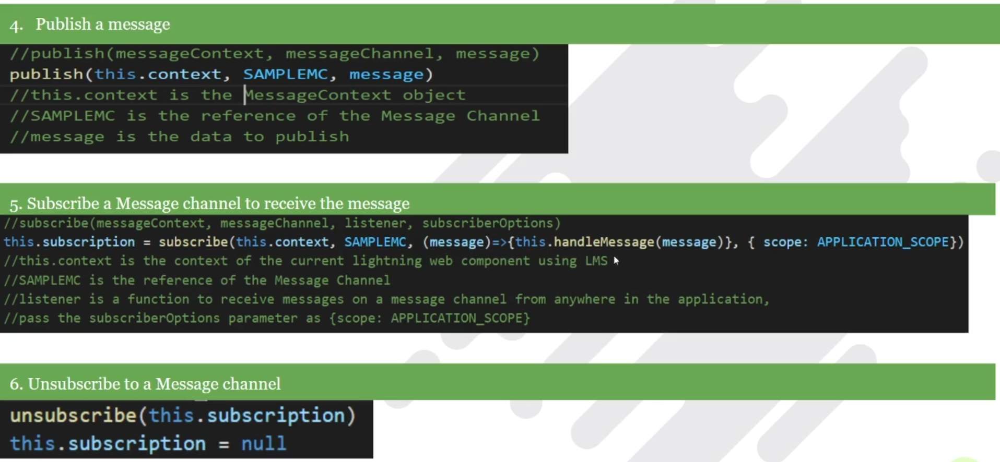
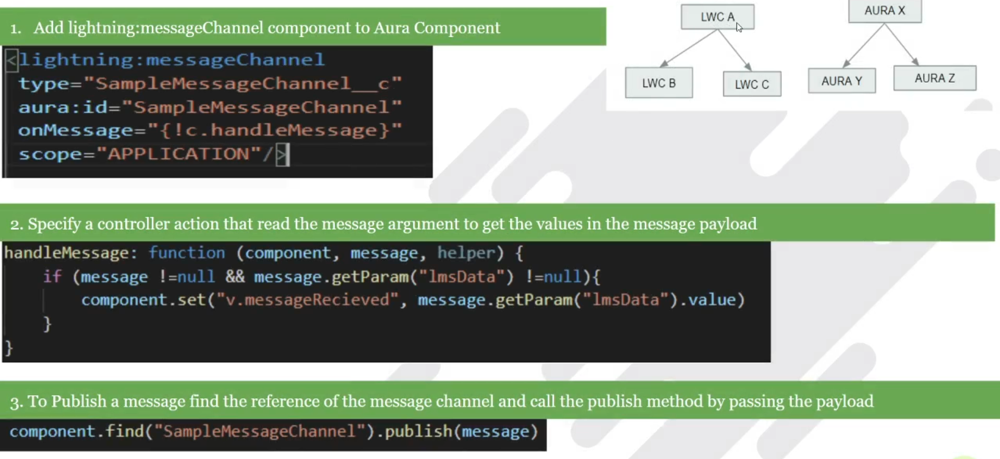
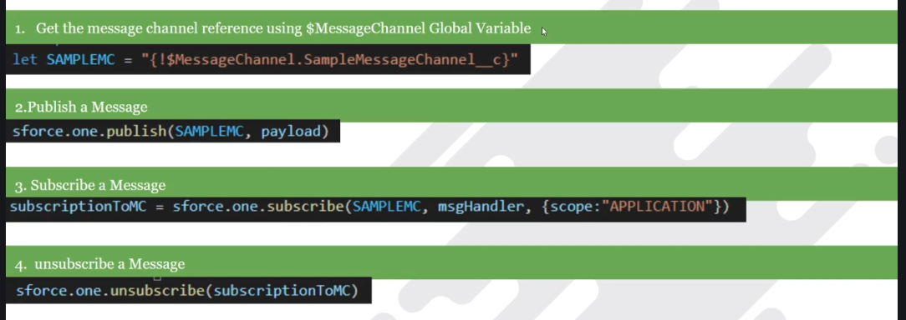

Lightning Messaging Service
    LMS is the first Salesforce technology which enables you to communciate between Visualforce, Aura component and Lightning web component anywhere in lightning pages including utility components.  
    In Winter 20, Salesforce is released "Lightning Message Service" (LMS)
      
    Prerequisite to create the message channel
        1. Create a folder called messageChannels under the path force-app\main\default
        2. create a file CHANNELNAME.messageChannel-meta.xml inside the folder
        
        3. Add following XML definition to message channel file
        
        4. Update the manifest/package.xml file by adding the LightningMessageChannel
        
        5. API Version should be above 47 & above  
    LWC to LWC Communication using LMSs
    
      
    LWC To AURA Communication using LMS
    
    LWC to VisualForce Page Communication using LMS
    
