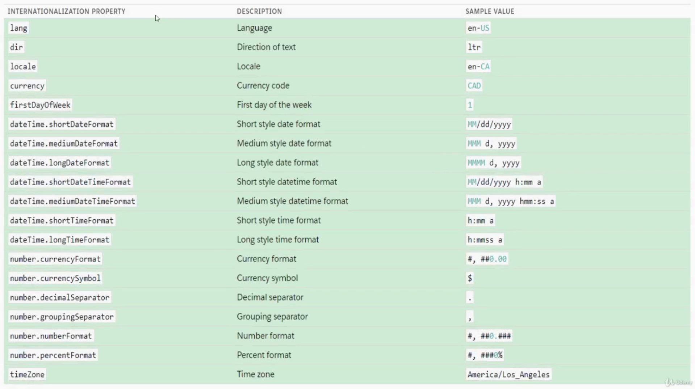

<h2>Static Resources</h2>
    Import static resources from the <b><i>@salesforce/resouceUrl</i></b> scoped module. Static resources can be archives (such as .zip and .jar files), images, style sheets, JavaScript and other files.   
    
    import myResource from'@salesforce/resourceURL/resourceReference';

`myResource` - A anem that refers to the static resource. 
`resourceReference` - The name of the static resource.  
A static resource name can contain only underscores and alphanumeric characters and must be unique in your org. It must begin with a letter, not include spaces, not end with an underscore, and not two consecutive underscores.

<h2>Third-Party JavaScript Libraries in LWC</h2>
<b>Syntax:</b>  
<ol>
    <li>
Import the static resource.</li>

    import resourcename from '@salesforce/resourceURL/resourceReference';

<li>Import methods from the platformResourceLoader module.</li>

    import { loadScript } from 'lightning/platformResourceLoader';
</ol>
loadScript(Reference to the component, fileUrl): Promise

<h2>Use Third-Party CSS Libraries</h2>
<b>Syntax: </b>  
<ol>
    <li>
    Import the static resource.</li>

    import resourcename from '@salesforce/resourceURL/resourceReference';
    
<li>Import methods from the platformResourceLoader module.</li>

    import { loadStyle } from 'lightning/platformResourceLoader';
</ol>
loadStyle(Reference to the component, fileUrl): Promise

<h2>Content Asset Files</h2>
Import content asset files from the <b><i>@salesforce/contentAssetUrl</i></b> scoped module. Convert a Salesforce file into a content asset file to use the file in custom apps and Community templates.  
<b>Syntax: </b> 
    
    import myContentAsset from '@salesforce/contentAssetUrl/contentAssetReference';

<h2>Internationalization Properties</h2>
    Lightning web components have internationalization properties that you can use to adapt your components for components for users worldwide, across languages, currencies and timezones.  
    In a single currency organization, Salesforce administrators set the currency locale, default language, default locale and default time zone for thier organizations. Users can set their individual language, locale and time zone on thier personal settings pages. 
    <b>Syntax: </b> 

    import internationalizationPropertyName from @salesforce/i18n/internationalizationProperty

<b>Packages Involved:</b>

<h2> Access labels </h2>
Import labels from the <i><b>@salesforce/label</b></i> scoped module.  
Custom labels are text values stored in Salesforce that can be translated into any language that Salesforce supports. Use custom labels to create multilingual applications that present information (for example help text or error messages) in a user's native language.  
<b>Syntax: </b>

    import labelName from '@salesforce/label/LabelReference';
Note** - The name of the label in your org in the format <b><i>namespace.labelName</i></b>

<h2> Check Permissions </h2>
Import Salesforce permissions from the <i><b>@salesforce/userPermission</i></b> and <i><b>@salesforce/customPermission</i></b> scoped modules.  

<b>Syntax:</b>

    import hasPermission from '@salesforce/userPermission/PermissionName';
    import hasPermission from '@salesforce/customPermission/PermissionName';

<h2>Access Client Form Factor</h2>
To access the form factor of the hardware the browser is running on, import the <i><b>@salesforce/client/formFactor</i></b>scoped module.  
<b>Syntax:</b>

    import formFactorPropertyName from '@salesforce/client/formFactor'
<b>Possible Values are: </b> 
    <ul>
    <li>Large - A desktop client. </li>
    <li>Medium - A tablet client. </li>
    <li>small - A phone client. </li>
    </ul>
<h2>Get Information About the Current User</h2>
To get information about hte current user, use the <i><b>@salesforce/user</b></i> scoped module.  
<b>Syntax:</b>

    import property from '@salesforce/user/property';
Property supports only two properties: 
<ol>
<li> <b> Id </b> - User's ID</li> 
<li> <b> isGuest </b> - Boolean Value indicating whether the user is a community guest user or not.</li>
</ol>

<h2>Fetch Record Id and Object Name</h2>
<b><i>@api recordId -</i> </b>If a component with a <b><i>recordId</i></b> property is used on a Lightning record page, the page sets the property to the ID of the current record.  
<b><i>@api objectApiName - </i></b> If a component with an <i><b>objectApiName</i></b> property is used on a Lightning record page, the page sets the property to the API name of the current object.

<h2>Toast Notification</h2>
Toast is a popup that alert user with some information. Toast can be success, error, info or warning.

    import { ShowToastEvent } from 'lightning/platfromShowToastEvent';

    const evt = new ShowToastEvent({
        title: "toast title",
        message: "toast message",
        variant: "toast variant", //(sucess, info, warning or error)
    });

    this.dispatchEvent(evt);
    
<b>messageData</b> - url and label values that replace the {index} placeholders in the message string.  
<b>Mode</b> - Determines how persistent the toast is. Valid values are:
<ol>
    <li><b>dismissable</b>(default) - Remains visible until the user clicks the close button or 3 seconds has elapsed, whichever comes first.</li>
    <li><b>pester</b> - visibel for 3 seconds.</li>
    <li><b> sticky</b> - remain visible until the user clicks the close button.</li>
</ol>