<h2>Types of Navigations</h2>
<ul>
    <li>Navigation to Home Page</li>
    <li>Navigation to Chatter</li>
    <li>Navigation to New Record</li>
    <li>Navigation to New Record With Default Values</li>
    <li>Navigation to List View</li>
    <li>Navigation to Files</li>
    <li>Navigation to  Record Oage in View and Edit Mode</li>
    <li>Navigation to tab</li>
    <li>Navigation to Record Relationship Page</li>
    <li>Navigation to External Web Page</li>
    <li>Navigation to LWC Component</li>
    <li>Navigation to AURA Component</li>
    <li>Navigation to VF Pages</li>
    <li>Fetch Current Page Reference</li>
</ul>

<h2> Steps to Use Navigation Service</h2>
In the component's JavaScript class, import the lightning/navigation module

    import { NavigationMixin } from 'lightning/navigation';

Apply the NavigationMixin fuction to your component's base class

    export default class MyCustomElement extends NavigationMixin(LightningElement) {}

To dispatch the navigation request, call the navigation service's 
    
    [NavigationMixin.Navigate](pageReference, [replace])

<b>pageReference</b> - It is an obejct that defines the page. 
<b>Replace</b> - It's a boolean values which is false by default. If this value is <b>true</b> it pageReference replaces the existing entry in the browser history.

<h2>PageReference Types</h2>
To navigate in Lightning Experience, Lightning communities or the Salesforce mobile app, define a PageReference object.
  
These page reference types are supported
<ul>
    <li>App</li>
    <li>Lightning Component</li>
    <li>Knowledge Article</li>
    <li>Login Page</li>
    <li>Named Page (Communities)</li>
    <li>Named Page (Standard)</li>
    <li>Navigation Item Page</li>
    <li>Object Page</li>
    <li>Record Page</li>
    <li>Record Relationship Page</li>
    <li>Web Page</li>
</ul>

<h2>Navigation to Home Page</h2>

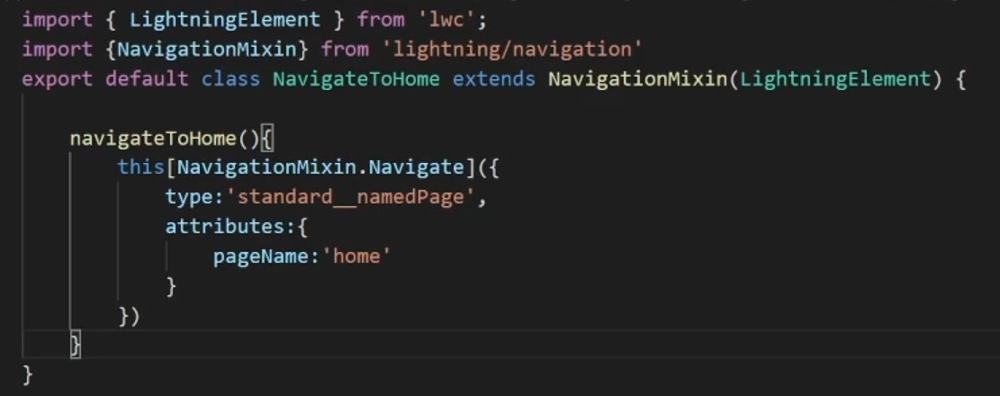

<h2>Navigation to Chatter</h2>

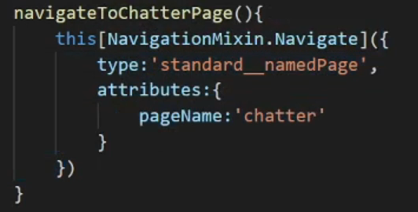

<h2>Navigation to New Record</h2>

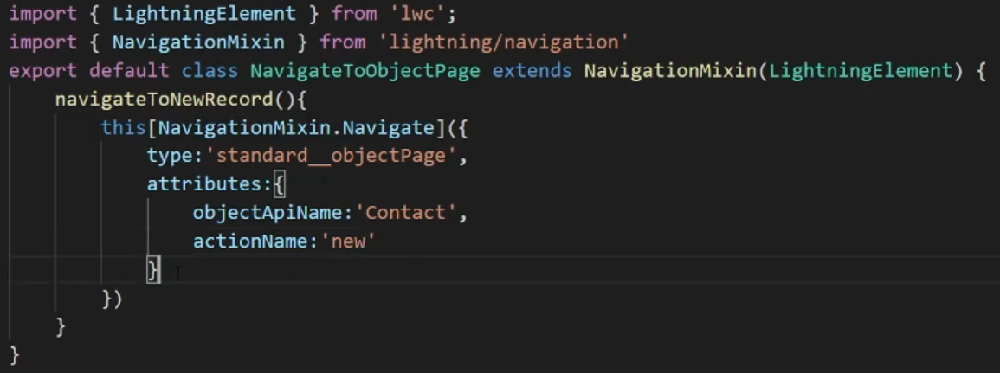

<h2>Navigation to New Record With Default Values</h2>

Initially we need to Import 

    import {encodeDefaultFieldValues} from 'lightning/pageReferenceUtils'

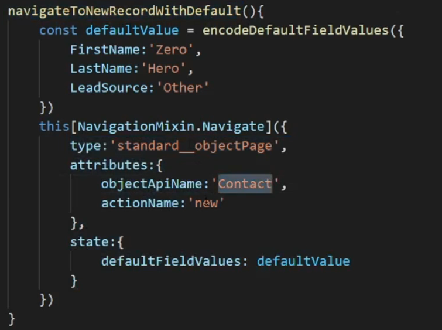

<h2>Navigation to List View</h2>

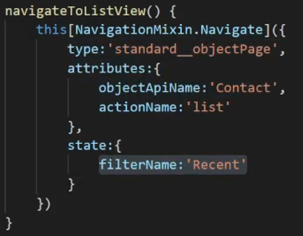

<h2>Navigation to Files</h2>

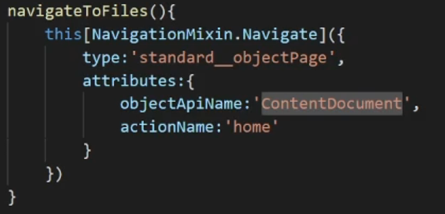

<h2>Navigation to  Record Oage in View and Edit Mode</h2>
<h3>View Mode: </h3>

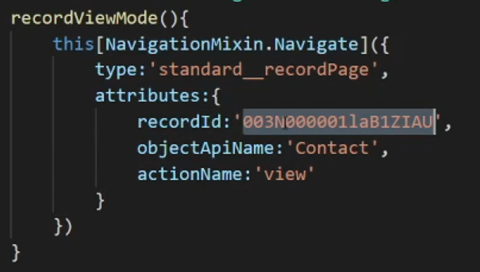

<h3>Edit Mode: </h3>

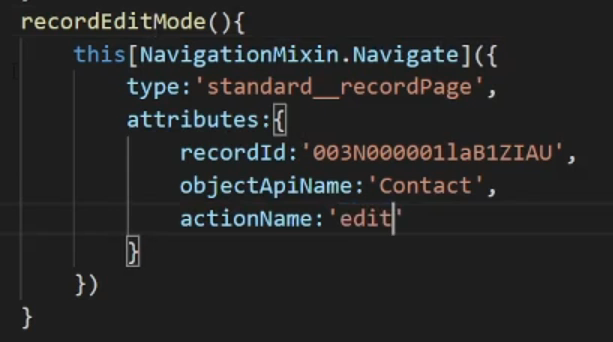

<h2>Navigation to tab</h2>

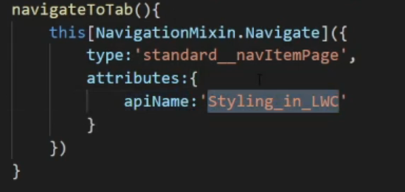

<h2>Navigation to Record Relationship Page</h2>

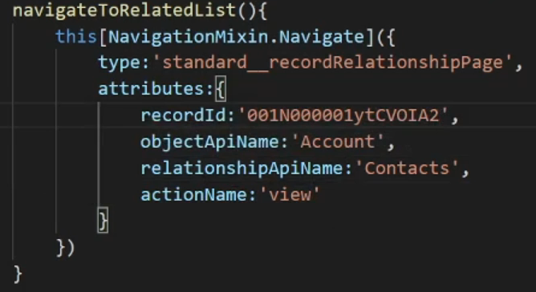

<h2>Navigation to External Web Page</h2>

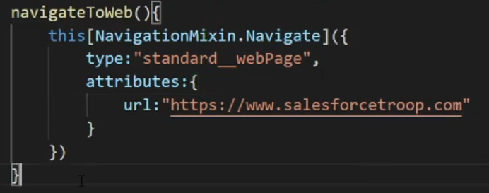

<h2>Navigation to LWC Component</h2>

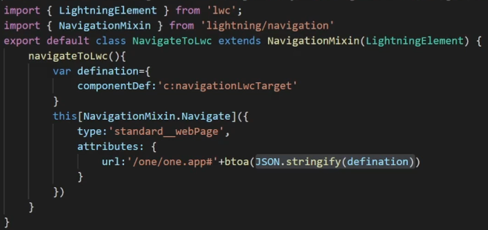
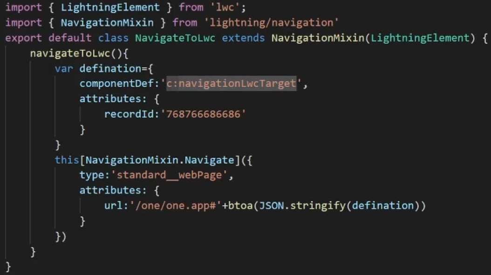

<h2>Navigation to AURA Component</h2>

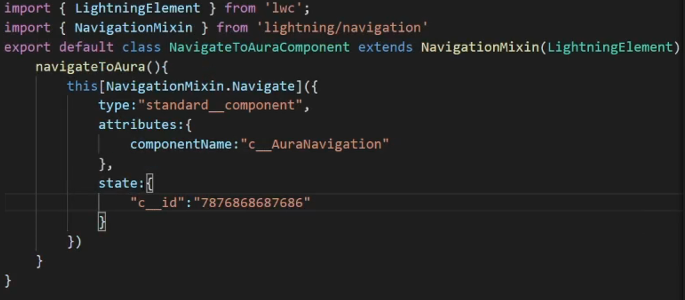

<h2>Navigation to VF Pages</h2>

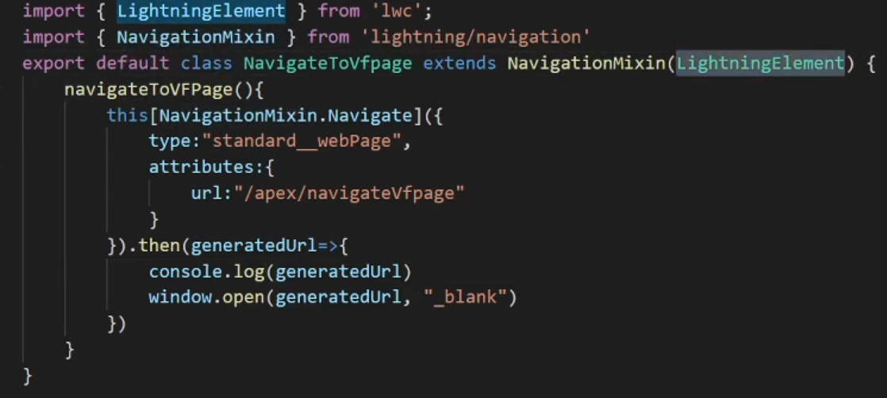

<h2>Fetch Current Page Reference</h2>

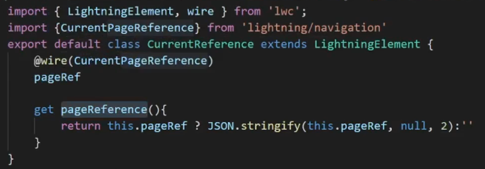