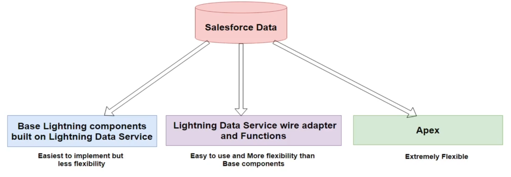
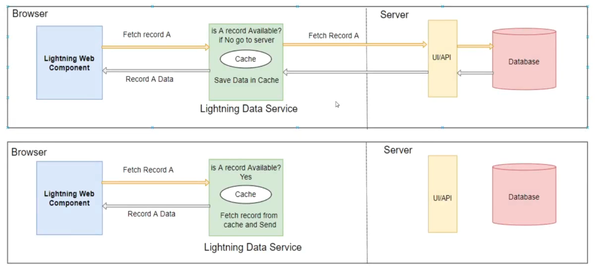
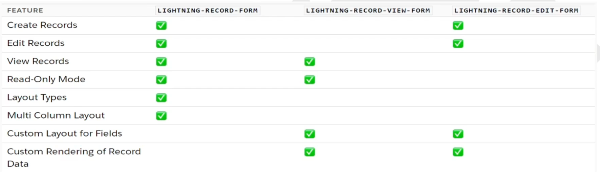
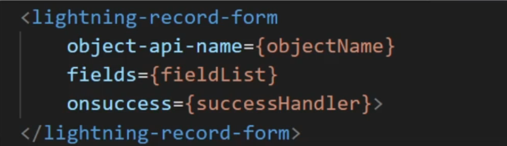
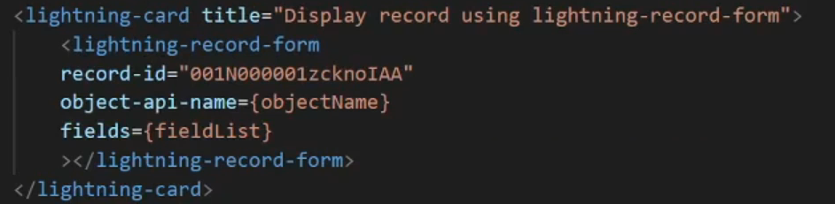
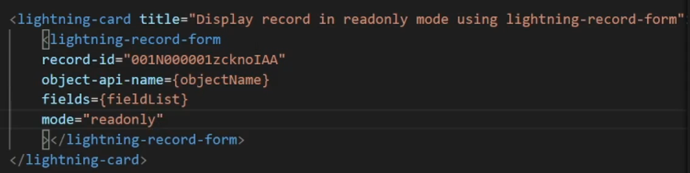
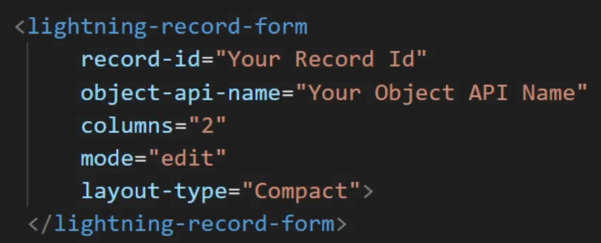
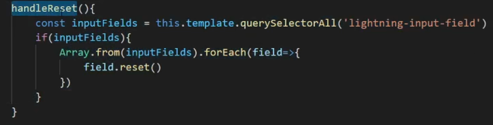

<h1> Work With Data in Lightning Web Components </h1>

There are many ways of interacting with salesforce data in the Lightning web components. Knowing which approch to use for a particular use case helps you to write less code, easier code and code that is more maintainable. The efficiency of your components is improved by using the best solution for each situation.

<h2> Lightning Data Service</h2>

Lightning Data Service is a centralized data caching framework and it is built on top of User Interfrace API

<h3> Benifits of LDS </h3>

1. Lightning Data Service is a centralized data caching framework and it is built on top of User Interface API.
2. UI API gives you data and metadata in a single response and also respect CRUD access, field-level security settings and sharing settings.
3. LDS displays only records and fields for which users have CRUD access and FLS visibility 
4. LDS caches results on the client
5. LDS Invalidates cache entry when salesforce data and metadata changes.
6. Optimizes server calls.

<h2> Base Lightning Components </h2>

Base Lightning Components are built on Lightning Data Service. So Lightning Data Service is used behind the scenes by base components and inherits its caching and synchronisation capabilities. 

There are three types of base lightning components built on LDS are

1. lightning-record-form => Supports edit,view and read-only modes.
2. lightning-record-edit-form => Display an editable form.
3. lightning-record-view-form => Displays a form in view mode.

<h3> When to use these form? </h3>

<li>Create a metadata-driven UI or form-based UI similar to the record detail page in SalesForce.</li>
<li>Display record values based on the field metadata</li>
<li>Hide or show localized field labels.</li>
<li>Display the help text on a custom field</li>
<li>Perform client-side validation and enforce validation rules.</li>
 
With lightning-record-form, you can specify a layout and allows admins to configure form fields declaratively. You can also specify an ordered list of fields to programmactically define what's displayed. lightning-record-form allows you to view and edit records.

<h2>lightning-record-form</h2>

Use the lightning-record-form component to quickly create forms to add, view or update a record.

The lightning-record-form component provides these helpful features:
<ul>
<li>Switches between view and edit modes automatically when the user begins editing a field in a view form</li>
<li>Provides Cancel and Save buttons automatically in edit forms</li>
<li>Uses the object's default recors layout with support for multiple columns</li>
<li>Loads all fields in the object's compact or full layout or only the fields you specify</li>
</ul>

lightning-record-form is less customizable. To customize the form layout or provide custom rendering of record data, use lightning-record-edit-form (add or update a record) and lightning-record-view-form(view a record).

<b>Note**</b>  Whenever possible to boost performance, define fields instead of a layout. Specify a layout only when the administartor, not the component, needs to manage the provisioned fileds.

<h2>Lightning-record-form key attributes</h2>

<b>object-api-name</b> - This attribute is always required. The lightning-record-form component requires youto specify the object-api-name attribute to establish the relationship between a record and an object.

<b> Note</b> - Event and Task objects are not supported.

<b>record-id</b> - This attribute is required only when you're editing or viewing a record.

<b>fields</b> - pass record fields as an array of strings. The fields display in the order you list them.

<b>layout-type</b> - Use this attribute to specify a Full or Compact layout. Layout are typically defined (created and modified) by administrators.

<b>modes</b> - This form support three mode</b>

1. <b>edit</b> - Creates an editable form to add a record or update an existing one. Edit mode is the default when record-id is not provided and displays a form to create new records.

2. <b>view</b> - Creates a form to display a record that the user can also edit. The record fields each have an edit button. View mode is the default when record-id is provided.

3. <b>readonly</b>- Creates a form to display a record that the user can also edit.

<b>columns</b> - Use this attribute to show multiple columns in the form.

<h2> Create a Record using lightning-record-form</h2>

Import references to Salesforce objects and fields from `@salesforce/schema`.

    import objectName from '@salesforce/schema/objectReference';

    import fieldName from '@salesforce/schema/object.fieldReference';
<b>syntax:</b>

<h2> Display a Record using lightning-record-form</h2>

We can display in two 

1. <b>view</b> - In this mode,form using output fields with inline editing enabled. 
<b>syntax:</b>

2. <b>read only</b> - In this mode, form loads wiht output fields only and you will not see edit icon and cancel buttons. 
<b>syntax:</b>

<h2> Edit a Record using lightning-record-form</h2>

Component using view mode by default. We can allow users to update fields directly in edit mode. 
<b>syntax:</b>

<h2>lightning-record-view-form</h2><ul>
<li> Use the lightning-record-view-form component to create a form that displayes Salesforce record data for specified fields associated with that record. The fields are rendered with their labels and current values as read-only </li>
<li>You can customize the form layout or provide custom rendering of record data. If you don't require customizations, use lightning-record-form instead</li>
<li> To specify read-only fields, use lightning-output-field components inside lightning-record-view-form.
</ul>

<h2>lightning-record-edit-form</h2>
<ul>
<li>This component is used to create and edit the records.</li>
<li>It provides custom layout of fields and custom rendering of record data</li>
</ul>

<h2>Reset the lightning-record-edit-form</h2>

