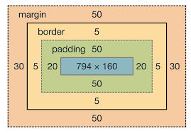

CSS
    CSS stands for Cascadin Style Sheets
    CSS is used to control the style of a web page

CSS Syntax
    selector { property: value}
    selector - it is used to "find" the HTML element.
    property - CSS property you want to apply like color, border etc.
    value - it's the value assigned to property like for color property value is red

CSS Selectors
    CSS selector are used to "find" (or select) the HTML elements you want to style.
    Element selector - use of HTML tags for styling
        e.g: p{color:blue;}
    ID selector - uses the id attributeof an HTML element to select a specific element. To select an element with a specific id, write a hash(#) character, followed by the id of the element. The id of an element should be unique within a page.
        e.g: #Username{color:red;}
    Class Selectr - uses the class attribute of an HTML element to select a specific element. To select an element with a specific class, write a dot(.) character, followed by the class of the element.
        e.g: .Username{color:blue;}

Type of CSS styles
    There are Three types of CSS styles
        1. Internal CSS - Not used in LWC
        2. Inline CSS
        3. External CSS or Third party library - Bootstrap, salesforce lightning design system

CSS Box Model
    It is a box that wraps around every HTML element.
    