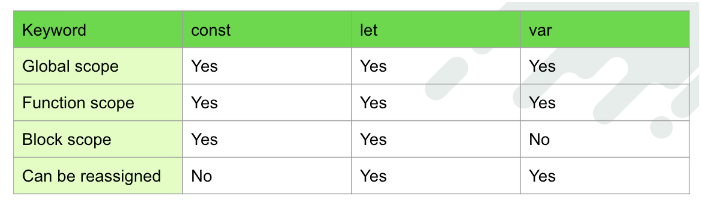
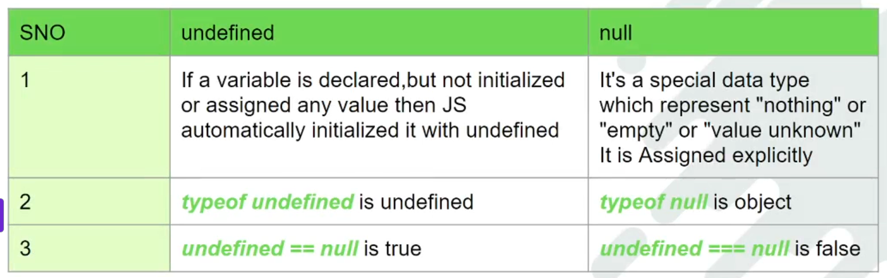
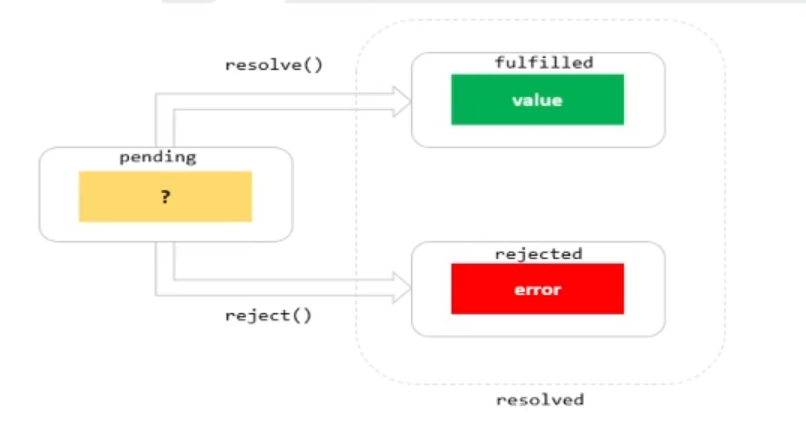
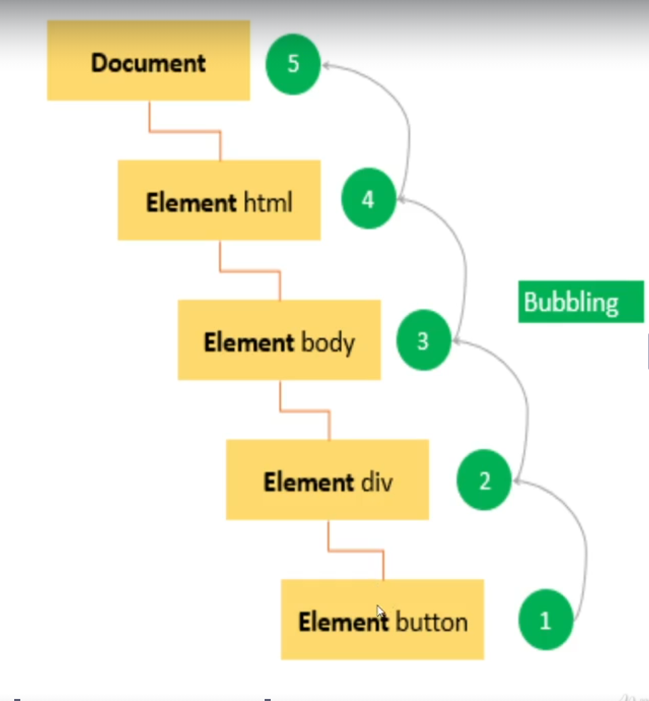
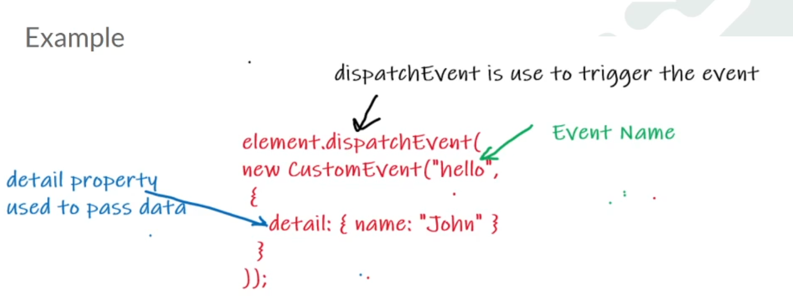
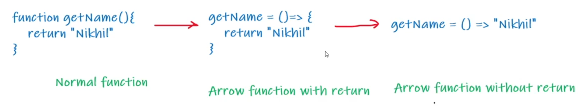

Java Script
    Java Script is a scripting or programming language that allows you to implement complex faetures on web pages
    It brings interactivity to the web pages

1. Variables
    Variables are the containers for storing data values
    var, const and let are the reserved keywords to declare a variable 
    JavaScript identifiers are case-sensitve.
    You can assign a value to a variable using equal to (=) operator when you declare it or before using it.
    

    const and let also support global scope but unlike var they does not create a property on global object
    e.g: 
        var x = "global"
        let y = "global";
        console.log(this.x); // "global"
        console.log(this.y); // undefined

    let variables can be updated but not re-declared
    const variables can neither be updated not re-declared

2. Data types in JS
    There are 8 basic data types in JavaScript
    number
    string
    boolean
    bigInt // if the number is appended with n at end its bigInt
    undefined
    null // when we check the type we will get object but its a mistake in JS and fixing it would break the internet
    object
    Symbol // var sym = Symbol("id")
    Rest all types are Objects in some form

3. Null vs Undefined
    

Equality Comparison
    == This operator does value comparison.
    === This operator does value plus data type comparsion.

4. Spread Operator
    The operator's shape is three consecutive dots and is written as: ...
    usages of spread operator 

    Expanding String -  Convert string into list of array 
    Combining Arrays - Combine array or add value to array
    Combining Object - Combine Object or add value to object
    Creating New Shallow Copy of Arrays and objects 

5. Destructuring
    The two most used data structures in JavaScript are Object and Array

    Destructuring is a special syntax that allows us to "unpack" arrays or objects into a bunch of variables, as sometimes that's more convenient.

    Array destructuring
    Object destructuring

6. String Interpolation
    String interpolatoin allows you to embed expressions in the string 
    Template string use back-ticks(``) rather than the singel or double-quotes.

7. String Methods
    Java Script provides Many metodes to play with strigns. Below are the some of the most commonly used strings method in LWC
        1. includes()
        2. indexOf()
        3. startsWith()
        4. slice()
        5. toLowerCase()
        6. toUpperCase()
        7. trim()

8. Object/ JSON Operations
    1. Object.keys()
    2. Object.values()
    3. JSON.stringify()
    4. JSON.parse()

9. Array Methods
    1. map() - loop over the array and return new array based on the value return.
    2. every() - return true or false if every element in the array satisfy the condition.
    3. filter() - return new array with all the elemnts that satisfy the condition
    4. some() - return true if at least one element in the array satisfy.
    5. sort() - sort the elements of an array
    6. reduce() - This method reduces the array to a singel value (left to right)
    7. forEach() - This method calls for each array element.

10. Promise
    Promise is an object that may produce a single value sometime in the future
    Promise are used to handle asynchronous operations in JavaScript.

    A promise has 3 states
    

    1. pending()
    2. fulfilled()
    3. rejected()

    Use case from LWC point of view
    1. Ferching data from server
    2. Loading file from system

11. Modules Import & Export

    Exports
        Exporting - Use export keyword to export many variable or many method from a file 
        e.g 1: export const name = 'vineeth'
        e.g 2: export function getName(){
            return 'vineeth'
        }

        Default export - Use export default keyword to export only one variable or a method from a file
        e.g: export default user = 'salesforce'

    Imports
        Importing - use import keyword to import variable or method from a given file path or module.

        Multiple imports : import {name, getName} from "./filepath"

        Imports all exported members : import * as Utils from "./filepath"

        Imports a module with a default member: import user from "./filepath"

12. Query Selector

    querySelector - The querySelector() method returns the first element that matches a specified CSS selector(s) in the docment.
    e.g: document.querySelector(selector);

    querySelectorAll - The querySelectorAll() method returns all element in the docuent that matches a specified CSS selector(s) as a static NodeList object.
    e.g: document.querySelectorAll(selector);

             
13. Event
    An event is an action that occurs int he web browser, which the web browser feedbacks to you so that youcan respond to it.

    For example, when users click a button on a webpage, youmay want to respond to this click event by displaying a alert box.

    Event handler - It is a block of code that will execute when the event occurs. It is also known as an event listener.

    Two common ways to add events
        1. HTML Event Handler attribute - When we add event through HTML, Event always begin with on keyword like onclick, onchange, onkeyup.

        2. Event Listener - Event Handlers provide two main methods for dealing with the registering/deregistering event listeners:
            addEventListener() - register an event handler
            removeEventListener() - remove an event handler

    Event Propagation - event propagtion explains the order in which events are recived on the page from the element where the event occurs and propagated through the DOM tree.

    There are two main event models
        1. Event Bubbling - In the event bubbling model, an event starts at the most specific element and then flows upward toward the least specific element (the document or even window)
        

        2. Event Capturing

    Custom Event
        In Java Script we can create our own custom event using Custom Event constructor
        syntax: new customEvent("eventName",{options})
        e.g : 
    
14. Arrow Function
    Arrow functions allow us to write shorter function syntax
    

    Benefits of Arrow functions:
        Arrow syntax automatically binds this to the surrounding code's contex

15. setTimeout vs setInterval

    setTimeout - The setTimeout() is a method of the window object. The setTimeout() sets a timer and executes a callback function after the timer expires

    setInterval - The setInterval() is a method of the window object. The setInterval() repeatedly calls a function with a dealy between each call.
