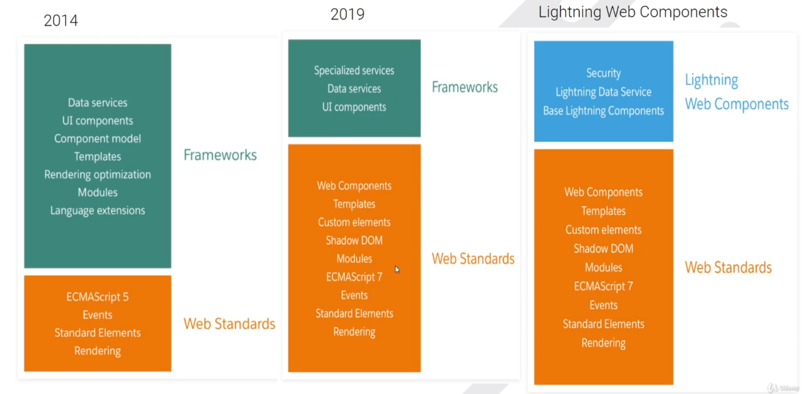

Lightning Framework
    The Lightning Component framework is a UI framework for developing single page applications for mobile and desktop devices.

    Lightning Components using two programming models

    1. Aura components Model
    2. Lightning Web Component Model

Web Stack transformation
    

Aura vs LWC
    Aura wad build on ES6(2009) javascript version 
    too much code to write 
    Rendering wasn't optimized
    mordern features was not available like modules, classes and promises

    LWC was build on mordern ES versions
    they have features like Shadow dom, web components, custom elements, template and slots.

What is Lightning Web Components
    Lightning Web Components is a new programming model for building Lightning components. It uses the core concepts of Web standards

Benefits
    1. Lightweight framework
    2. Better Performance
    3. No need to learn different framework to develop salesforce applications
    4. Interoperability with lightning Aura components
    5. Better testing using Jest
    6. Better Security

Coexistence and interoperability
    Aura components and Lightning web components can coexist and interoperate and they share the same high level services:
        Aura components and Lightning web components can coexist on the same page.
        Aura components can include Lightning web components but not other way around
        Aura components and Lightning web components share the same base Lightning components. Base Lightning components were alredy implemented as Lightning web components
        Aura components and Lightning web components share the same underlying services (Lightning Data Service, User Interface API, etc)

Lightning Experience
    Lightning Experience is the new user interface (UI) for salesforce installations; It is a significant upgarde from the salesforce classic view, brining modern apearance and functionality to the salesforce platfrom.

Salesforce Developer Experience (DX)
    It is a set of tools that streamlines the entire development life cycle. It improves team development and collaboration, facilitates automated testing and continuous integration and makes the release cycle more efficent and agile.
        1. Visual Studio Code
        2. Salesforce CLI
        3. Salesforce Extension Pack

My Domain - Having a custom domain is more secure, some salesforce features require it.

Dev Hub 
    we have to enable dev hub to
        1. Create and manage orgs from the command line
        2. view information about Scratch orgs
        3. Link Namespace orgs

DevHub vs Scratch org
    Dev Hub - its is the main Salesforce org that you will use to create and manage your scratch orgs.
    Scratch Org - it us a source-driven and disposable deployment of salesforce code and metadata. Scratch orgs are driven by source, Sandboxes are copies of production.

    Note - Scratch orgs do not replace sandboxes.

Project creation
    sfdx force:project:create -n "LWC project"
    -n : new project

Authorization of org
    sfdx force:auth:web:login -a lwcLearning -d
    -a : alias
    -d : default

Scratch Org Creation
    Add hasSampleData:"true" property to project-scratch-def.json

    sfdx force:org:create -a lwcScratchOne -d 30 -f config/project-scratch-def.json -s
    -a : alias
    -d : days(number of days scratch org alive 1 day min and 30 days max)
    -f : file location of project scratch definition json
    -s : set it to default username

Note : if anytime we encouter error "no org configuration for name" then run the following command
    sfdx force:config:set defaultdevhubusername="the DX DevHub username"

