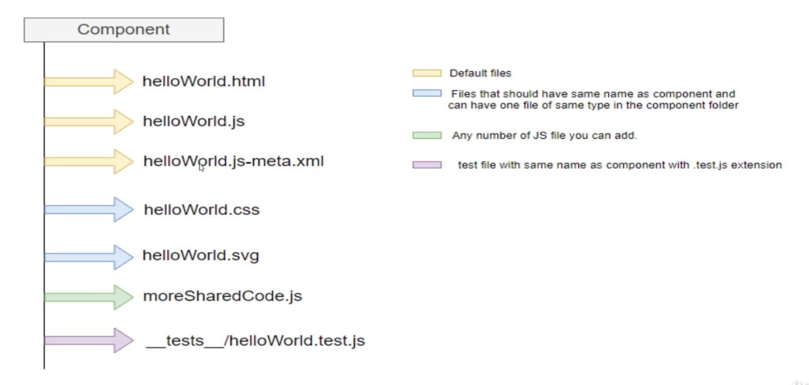
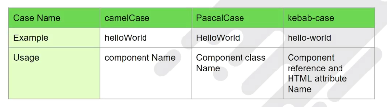
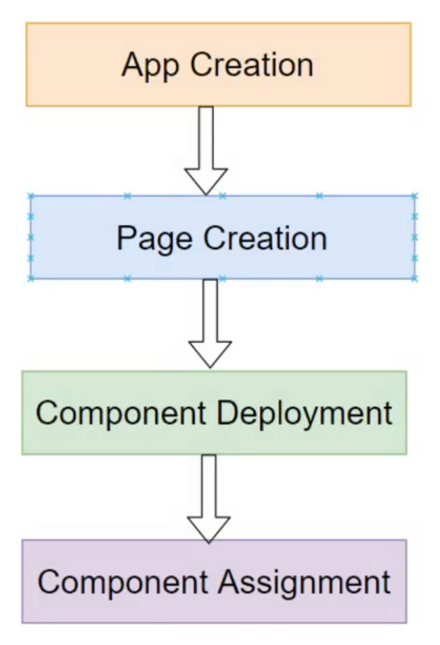
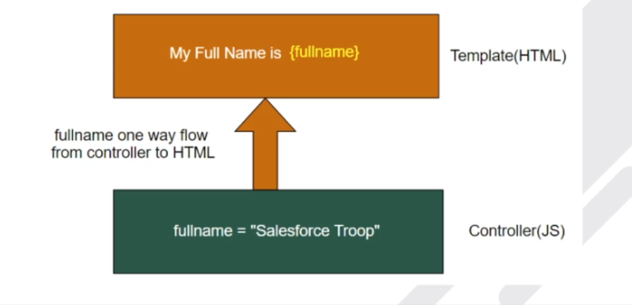
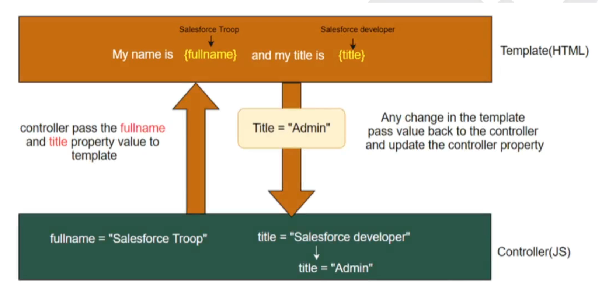
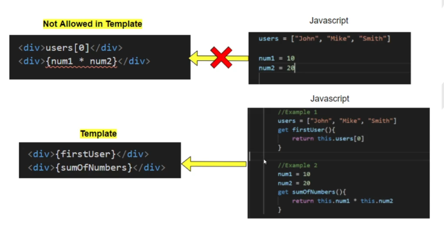
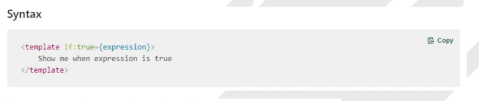
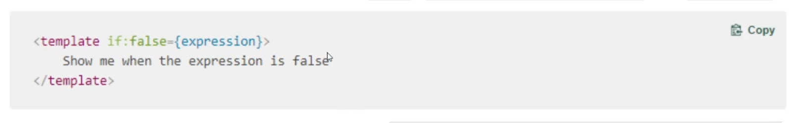
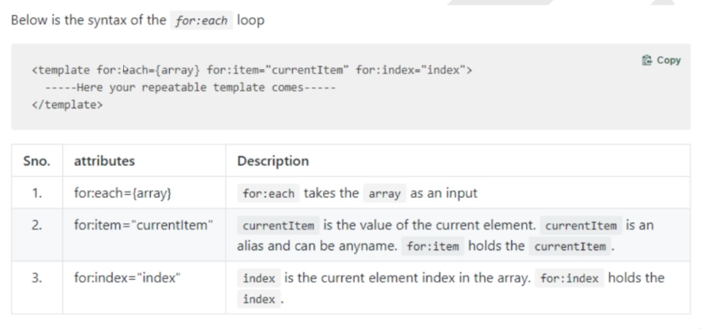
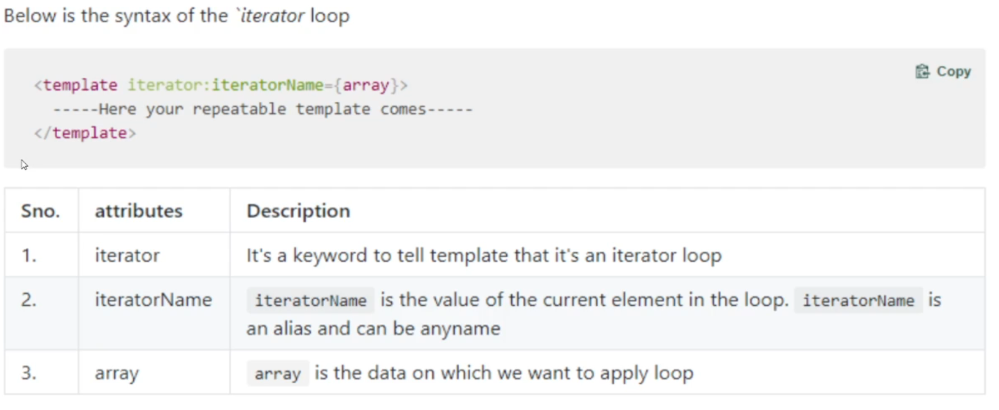

Component Naming convention
    The folder and its files must follow these naming rules.    
        1. Must begin with a lowercase letter 
        2. Contain only alphanumeric or underscore character 
        3. Must be unique in the namespace 
        4. cant end with an underscore 
        5. cant contain teo consecutive underscores 
        6. cant contain a hypen (dash)
    
Two ways to Create component 
    1. Using Terminal :  
        sfdx force:lightning:component:create --type lwc -n helloWorld  
    2. Using Command Pallete:  
    Vscode => view => command palette => type create lightning web component => hit enter => enter desired filename => hit enter => again hit enter to choose default path.

Component Folder Structure
    

Naming Conventions for LWC 
    1. camelCase : Each word in the middle of the respective phrase begins with a capital letter. 
    2. PascalCase : It is same like Camel Case where first letter always is capitalized. 
    3. kebab-case : Respective phrase will be transferred to all lowercase with hypen(-) separating words.
    

App Creation and Component Deployment
    

Data Binding in a Template
    Data binding in the Lightning web component is the synchronization between the controller and the template(HTML)
    

    Things to remember
        1. In Template we can access property value directly if its's primitiveor object.
        2. Dot notation is used to access the property from an object.
        3. LWC doesn't allow computed expressions like Names[2] or {2+2}
        4. The property in { } must be a valid JavaScript identifier or member expression. Like {name} or {user.name}
        5. Avoid adding spaces around the property, for example { data  }
    
Two way Data Binding in a Template
    

@track Property - When a field contains an object or an array, there's a limit to the depth of chages that are tracked. To tell the framework to observe changes to the properties of an object or to the elements of an array, decorate the field with @track

Normal Property vs @track property
    Without using @track, the framework observes changes that assign a new value to a field/property. If the new value is not === to the previous value, the component re-renders

What is Getter and When to use it 
    

What is Directive
    Directives are special HTML attributes. The LWC programming model has a few custom directives that let you manipulate the DOM using markup.

    In LWC we have two special directives for conditional rendering
        1. if:true
        2. if:false

if:true directive 
1. Use this directive to render DOM elements in a template, if the expression is true.
syntax

2. The expression can be a JavaScript identifier(property).
3. The expression can be a JavaScript dot notation that accessess a property from an object (user.fullName).
4. You can't use ternary operator inside the expression
5. To compute the value of the expression, use a getter in the JavaScript class.

if:false directive 
1. Use this directive to render DOM elements in a template, if the expression is false.
syntax

2. The expression can be a JavaScript identifier(property).
3. The expression can be a JavaScript dot notation that accessess a property from an object (user.fullName).
4. You can't use ternary operator inside the expression
5. To compute the value of the expression, use a getter in the JavaScript class.

Template Looping
    There are many scenarios in which we have to render the same set of elements with mostly same styling with diffrent data in the HTML. To solve this issue, we have template looping in the LWC

Template Looping Types 
    1. for:Each
    
    What is key and it's importance
        1. A key is a special string attribute you need to include to the first element inside the template when creating lists of elements.
        2. Keys helps the LWC engine identify which items have changed, are added, or are removed.
        3. The best ways to pick a key is to use a string thzt uniquely identifies a list item among its siblings.
        Note - Key must be a number or string, it's can't be an object
        You can't use the index as a value for the key  
    2. iterator loop - To apply s special behaviour to the first or last item in a list we prefer iterator over for:each
    

    Properties of iterator
    using iterator name you can access the following properties
    value - Thr value of the item in teh list. Use this property to access the peoperties of the array. For example: iteratorName.value.propertyName
    index - The index of teh item in the list. For example: iteratorName.index
    first - A boolean value indicating wheather this item is the first item in the list. example: iteratorName.first
    last - A boolean value indicating wheather this item is the last item in the list. example: iteratorName.last