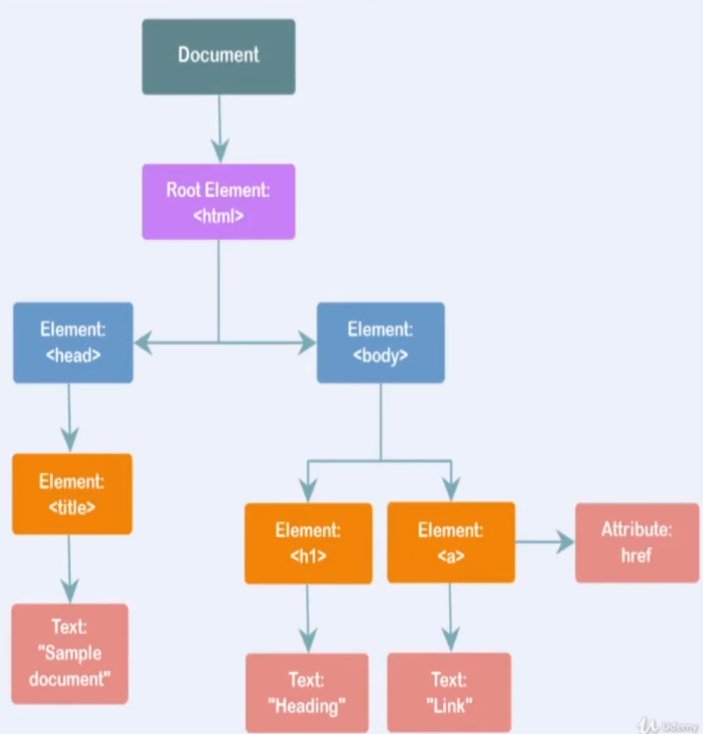
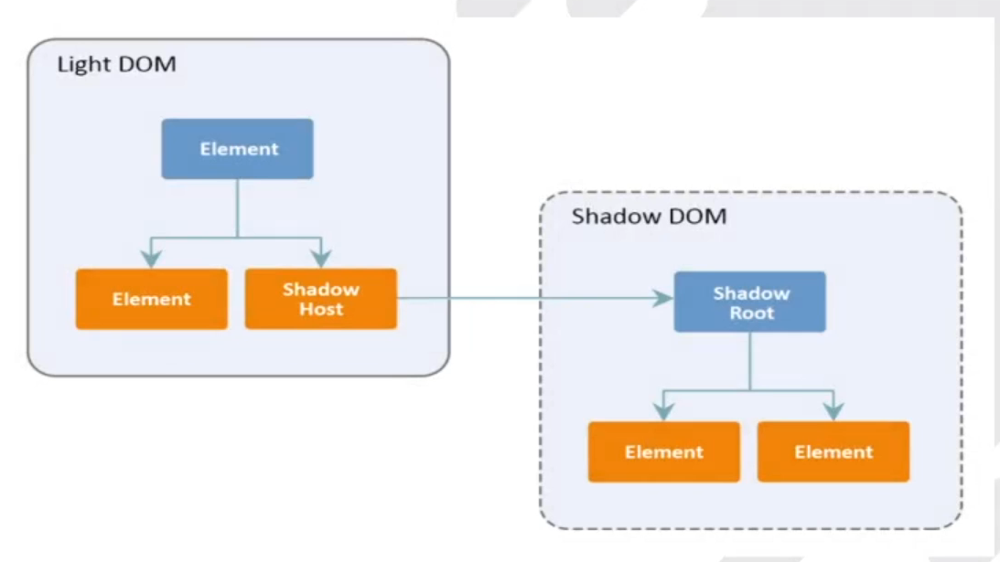
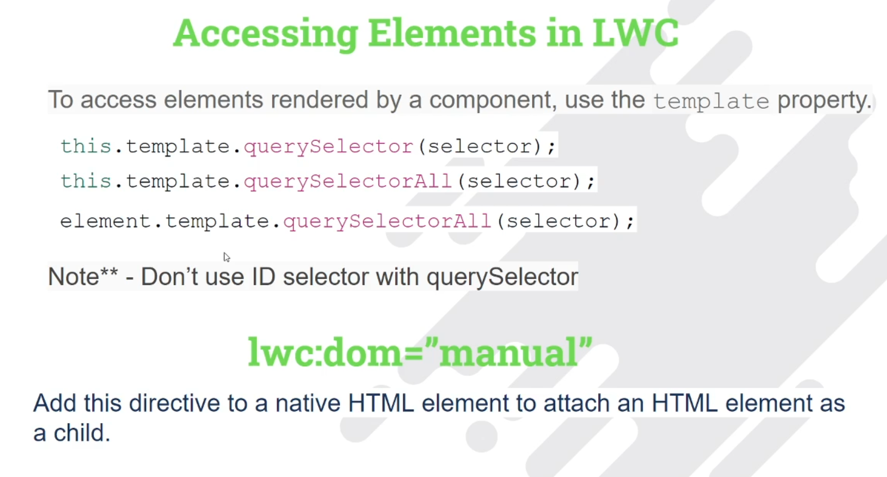

<h2>Component Composition</h2>

Composition is Adding Component Within the body of another component.

Composition enables you to build complex components from simpler building-block components.

<h2>How to refer child components name in parent components</h2>

1. childComponent = c-child-component
2. childComponentDemo = c-child-component-demo
3. sampleDemoLWC = c-sample-demo-l-w-c

<b>Note</b> : Replace captial letter with small letter and prefixed with hypen and try to avoid contious captial letters in your component name.

<h2>What is DOM</h2>

Document Obejct Model (DOM) is a programming API for HTML and XML documents. It defines the logicla structure of documents and the way a document is accessed and manipulated. Basically The DOM is a tree structure representation of web page.

<h2>What is Shadow DOM</h2>

Shadow DOM brings encapsulation concept to HTML which enables you to link a hidden separated DOM to an element.

Benefits of Shadow DOM - DOM quries, event propagation and CSS rules cannot go to the other side of the shadow boundry, thus crating encapsulation.
    
    
