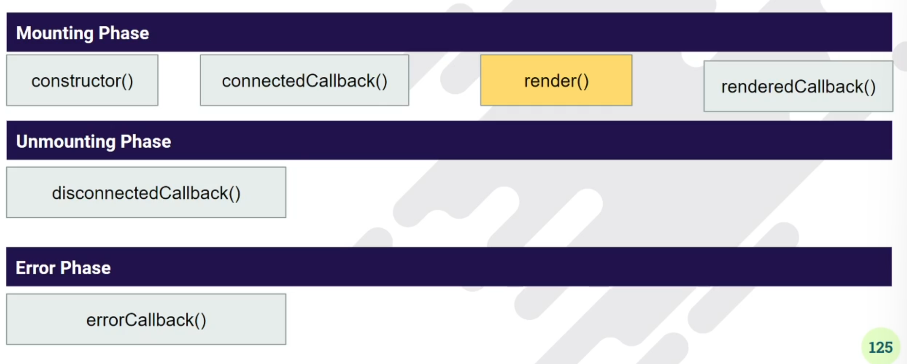
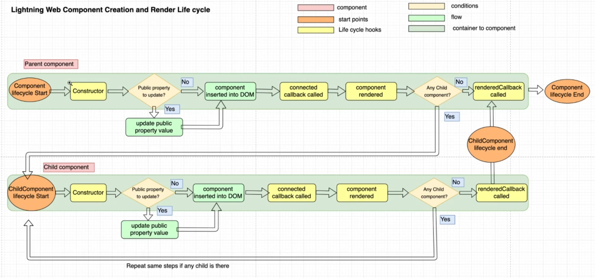

<h2>LWC Life Cycle hooks</h2>

A lifecycle hook is a callback method triggered at a specific phase of a component instance lifecycle.

<h2>Constructor Method</h2>

1. This hook is invoked, when a component instance is created.
2. You have to call super() first inside this
3. At this point, the component properties won't be ready yet.
4. To access the host element, use this.template
5. This method lifecycle flows from parent to child component
6. we can't access child elements in the component body because they don't exisst yet.
7. Don't add attributes to host element in the constructor.

<h2>connectedCallback Method</h2>

1. Called when the element is inserted into a document.
2. This hook flows from parent to child.
3. You can't access child elemnts in the component body because they don't exist yet.
4. You can access the host element with this.template
5. use it to: Perform initialization taks, such as fetch data, set up caches or listen for events (such as publish-subscribe events)
6. Do not use: connectedCallback() to change the state of a component, such as loading values or setting properties. Use getters and setters instead.

<h2>renderedCallback Method</h2>
 
1. Fires when a component rendering is done.
2. It can fire more than once.
3. This hook flows from child to parent.
4. When a componet re-renders, all the expressions used in the template are reevaluated.

<h3>Do not use renderedCallback()</h3>

1. to change the state or update property of a component.
2. Don't update a wire adapter configuration object property in renderedCallback(), as it can result in an infinte loop.

<h2>diconnectedCallback Method</h2>

1. Fires when a component is removed from the DOM
2. It flows parent to child
3. This callback method is specific to Lightning Web Components, it isn't from the HTML custom elements specification.

<h2>errorCallback(err, stack) Method</h2>

1. This method called when a descendant component throws an error in one of its callback.
2. The error argument is a JavaSvript native error obejct, and the stack argument is a string.
3. This callback method is specific to Lightning Web Components, it isn't from the HTML custom elements specifications.

<h2>render Method</h2>

Render is a method that tells the componet which template to load based on some conditions. It alwasys return the template reference.

1. The render() method is not technically a lifecycle hook. It is protected method on the LightningElement class.
2. call this method to update the UI. It may be called before or after connectedCallback()
3. It's rare to call render() in a component. The main use case is to conditionally render a template.

When to prefer multiple template over if:true/if:false

1. if:true/if:flase is recommend whenever there is small template to hide and show
2. Ideally it's always recommend to break down your component into smallest unit.
3. Whenever we have a scenario in which we have same buisness logic but we want to render a component with more than one look and feel.
4. Whenever we have two design in smae component but not want to mix the HTML in one file.
