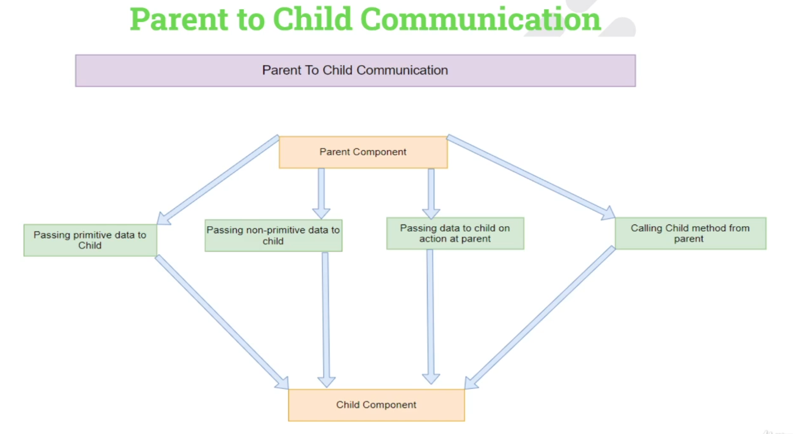
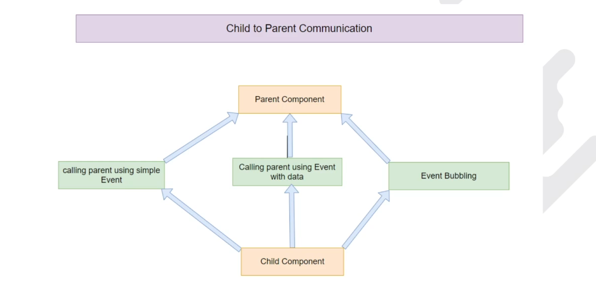
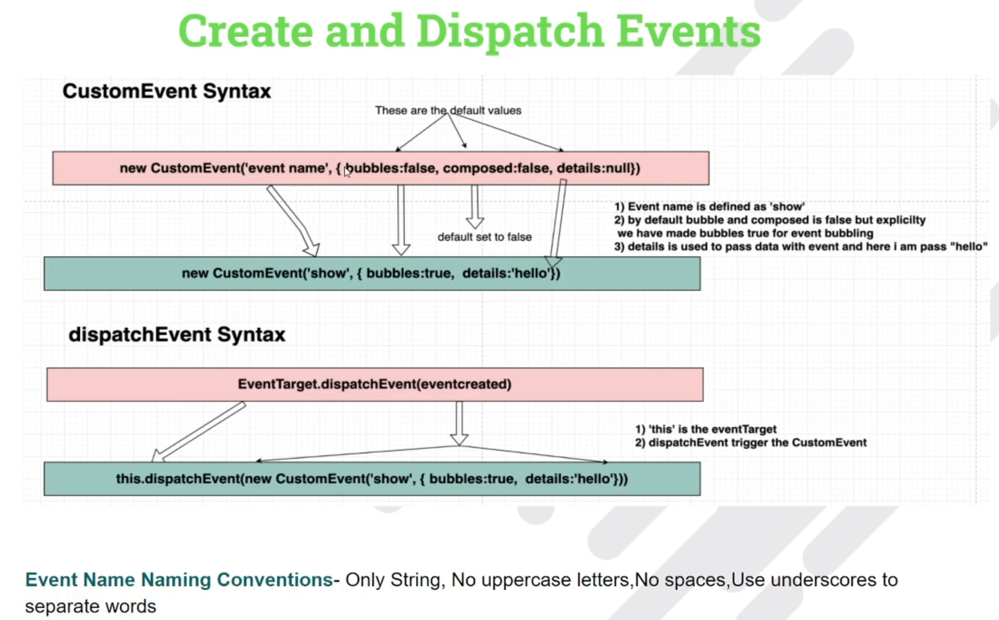
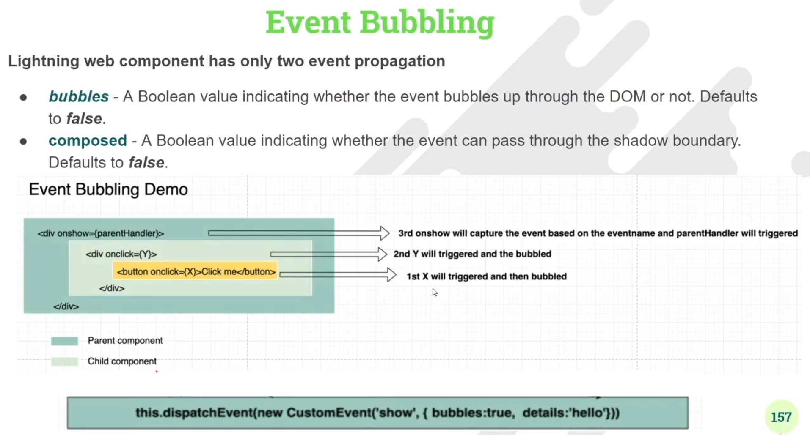
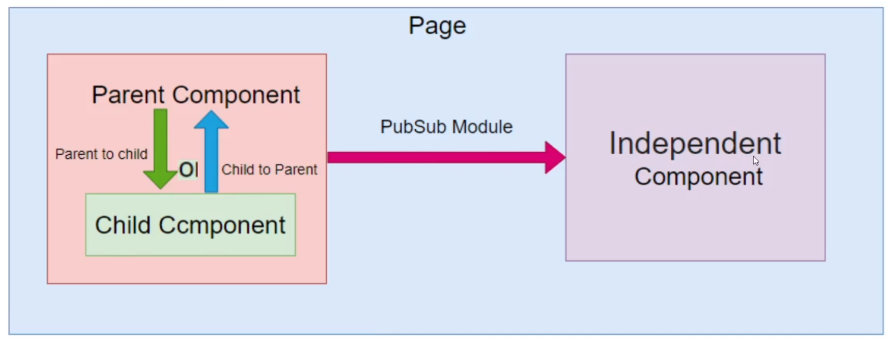

<h1>Components Communication Approches</h1>

<h2>1. Parent to Child Communication</h2>

<h3>@api decorator</h3>

1. To make a field/property or method public, decorate it with @api decorator
2. when we want to expose the property we decorate the field with @api 
3. AN owner componetn that uses the component in its HTML markup can access the component's public properties via HTML attributes.
4. Public properties are reactive in nature and if the value of the property changes the component's template re-renders

<h2>2. Child to Parent Communication</h2>

<h2>3. Sibling Component Communication Using PubSub</h2>

There are two ways to communicate between independent components

1. pubsub
2. Lightning Messaging Service

<b>Note:</b> Use this approach, if Lightining Messaging Service not serve your purpose. It's an old technique to communicate with the independent components in LWC.

<h2>4. Communication Across VF pages, Aura and LWC Using Lightning Messaging Service</h2>
